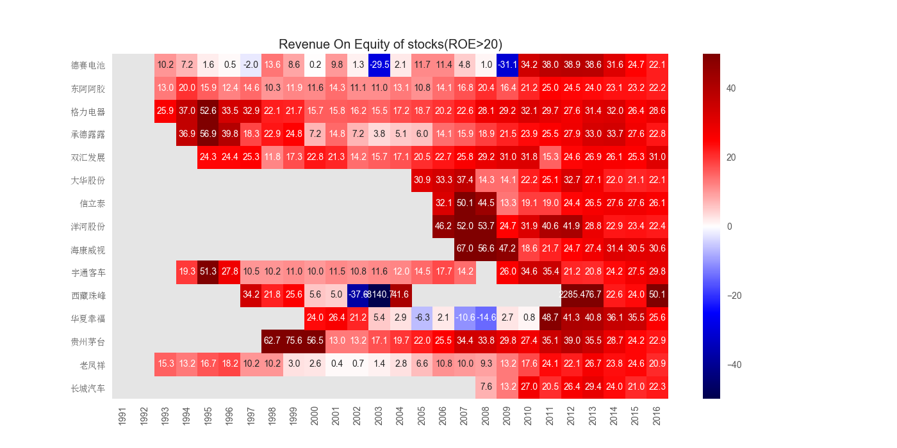
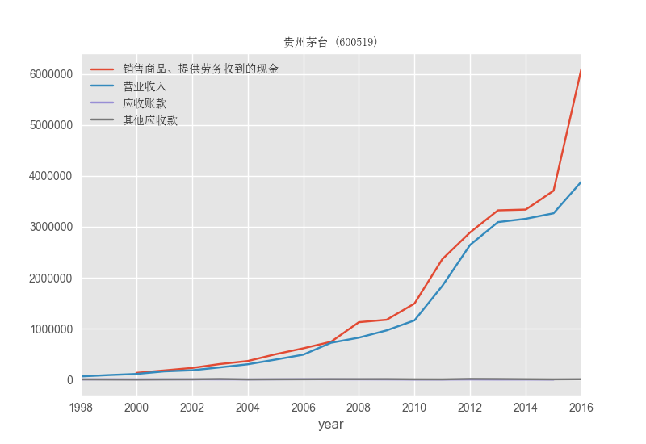
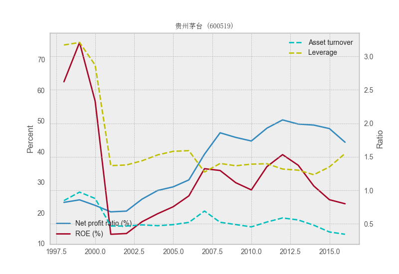
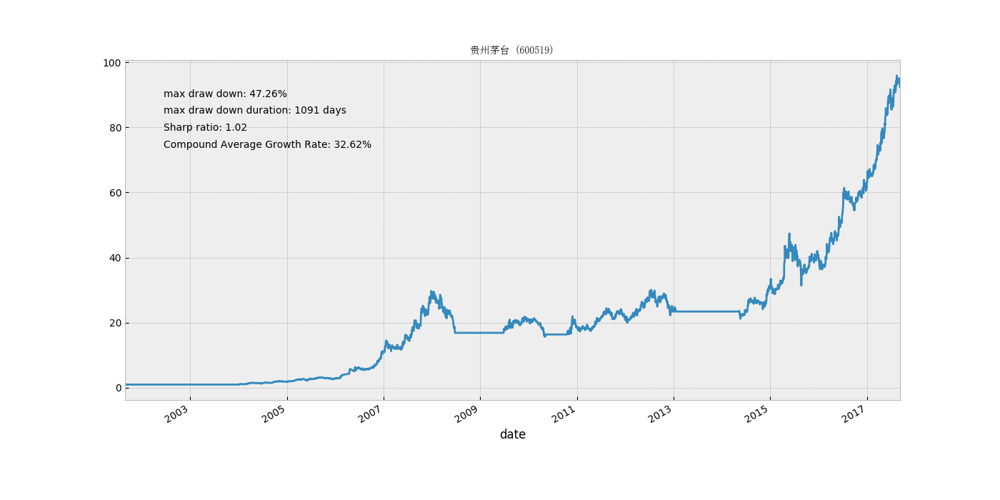

# lavender

lavender是一个基于本地财经数据，实现对A股策略回测和基本面分析的工具包。

lavender可以实现：
1. 对A股**历史行情数据**和**财报数据**的批量下载，清洗加工；
2. 基于下载的历史行情数据，实现对交易策略的回测；
3. 基于公司财报数据，进行基本面分析。

## Quick Start

### 1. 配置路径
配置文件config.py在主目录下：

设置工作目录，如：

    work_dir = r"C:\Users\Administrator\Desktop\lavender\lavender"

### 2. 数据批量下载

**导入lavender**：
    
    from lavender import *
    
**批量下载所有A股报表数据:**

    downloader = BasicsDownloader(year_range="1990:")
    downloader.get_fin_state(state_type)

其中参数*state_type*为报表类型，支持：
1. 资产负债表："BalanceSheet"
2. 利润表："ProfitStatement"
3. 现金流量表："CashFlow"

执行命令系统将下载1990年之后的所有A股报表数据。
下载数据以sqlite形式存储在*data/tables*目录下。

**更新已保存的报表数据库：**

    downloader = BasicsDownloader(year_range="2016:")
    downloader.update_fin_state(state_type)
其中参数*state_type*为报表类型（同上）。执行命令，系统将重新下载2016之后的报表数据。

**批量下载所有A股基本面指标数据**
    
    downloader = BasicsDownloader(year_range="1990:")
    downloader.get_table(table)

数据来源于新浪财经，下载接口直接批量调用tushare函数（参考：http://tushare.org/fundamental.html#id2）
其中*table*为基本面指标数据表，支持：
1. 业绩报告： "report"
2. 盈利能力： "profit"
3. 营运能力： "operation"
4. 成长能力： "growth"
5. 偿债能力： "debtpaying"
6. 现金流量： "cashflow"

执行命令后，程序将下载1990年之后的所有A股基本面指标数据。
下载数据以sqlite数据库形式存储在*data/tables*目录下。

**更新已保存的A股基本面指标数据库：**

    downloader = BasicsDownloader(year_range="2016:")
    downloader.update_table(table)
其中参数*table*为基本面指标数据表名（同上）。执行命令，系统将重新下载2016之后的报表基本面数据。

**批量下载所有A股历史行情数据**

    downloader = StockDownloader(date_range='1990-01-01:', autype='hfq')
    downloader.run("init", n_thread=10)
下载接口批量调用tushare函数（http://tushare.org/trading.html#id2）下载日线数据。
其中参数*autype*为数据类型，支持：前复权（"qfq"），后复权（"hfq"），不复权（None）。
这里建议默认下载后复权数据是因为前复权数据的每次更新需要对已下载的数据做更改；而我们做回测实验时，关心的是股价波动的相对值，而非绝对值，因而这里使用后复权数据。

执行命令后，lavender将下载1990年之后的所有A股日线行情数据。
默认开启10个线程下载。下载数据以csv格式保存在*data/stocks*目录下。

**更新已保存的A股基本面指标数据库：**

    downloader = StockDownloader(date_range='1990-01-01:', autype='hfq')
    downloader.run("update", n_thread=10)

执行命令，lavender将根据已有的数据自动更新至最新的日线数据。参数同上。

### 3. 基本面分析

lavender基本面分析模块提供了针对上市公司财报的一系列分析工具。

**基本面选股**
    
上市满5年，且ROE在近5年里均大于20%

    get_condition_indicator("profit", {"roe": ">20"}, "roe_gt_20.csv", num_year=5)

参数为：
    table_name：指标所在的表名；
    indicator_conditions：指标及对应的筛选条件；
    save_name：选择结果保存的文件名；
    num_year：应用条件的年份；
    筛选出股票默认保存在*result/pool*目录下。
    

**生成多只股票多年数据热力图**

选择ROE在近5年里均大于20%的股票集合，输出ROE热力图：

    plot_pooled_codes_heatmap("roe_gt_20.csv", "roe_gt_20.png", "profit", "roe",
                              main_title="Revenue On Equity of stocks(ROE>20)", vmax=50, vmin=-10)

参数为：
    pool_name：股票集合文件名
    save_name：保存的图片文件名
    table_name：指标所在表名
    indicator：指标名。
图片默认保存在*result/pics/fundamental*目录下。

    
**生成公司报表数据**
    
生成单只股票多个报表项目数据：
    
    show_single_code_statement("600519", {"Statement_ProfitStatement": ["营业收入", ],
                                      "Statement_CashFlow": ["销售商品、提供劳务收到的现金", ],
                                      "Statement_BalanceSheet": ["应收账款", "其他应收款"]},
                                       save_name="600519_cash_flow2.png")

参数为：
    code：所选股票代码
    indicator：报表项目及其所在的报表表名
    save_name：保存的图片名
图片默认保存在*result/pics/fundamental/code*目录下。

**杜邦分析**

生成单只股票的杜邦分解时间序列：

    dupont_decomposition("600519", save_name="600519_dupont.png")
    
杜邦分析函数参数为股票代码和保存的图片名，图片默认保存在*result/pics/fundamental/code*目录下。

### 4. 策略回测

在A股历史行情数据已保存在本地的基础上，lavender可以完成中低频交易策略的回测。

**配置股票集合文件**

股票集合文件可手动编辑，或使用分类脚本（category.py）或基本面分析工具（fundamental.get_condition_indicator）生成。
股票文件默认保存在*result/pool*目录下。
文件格式例如：
文件result/pool/roe_gt_20.csv 内容为：

    000049 德赛电池
    000423 东阿阿胶
    000651 格力电器
    000848 承德露露
    000895 双汇发展
    002236 大华股份
    002294 信立泰
    002304 洋河股份
    002415 海康威视
    600066 宇通客车
    600338 西藏珠峰
    600340 华夏幸福
    600519 贵州茅台
    600612 老凤祥
    601633 长城汽车

**编辑策略**

策略脚本文件为*strategy/strategy.py*。在Strategy类中编辑策略，例如双均线策略（60日均线上穿250日均线时买入，60日均线下穿250日均线时卖出）：

    @staticmethod
    def dual_ma_strategy(signal_type, k_line, date, ma_fast=60, ma_slow=250):
        """
        ma_fast < ma_slow: sell
        ma_fast > ma_slow: buy
        Inputs:
            k_line: <DailyKLineIO.Kline>: K line class for stock.
            signal_type: <str>:whether to judge if sell or
                   judge if buy or judge if the indicators exist
                signal_type = 'sell': determine whether to sell shares
                signal_type = 'buy': determine whether to buy shares
                signal_type = 'exist': determine whether indicators exist
            date: <pd.DatetimeIndex>: date of trading day.
        """

        ma_f = k_line.ma(ma_fast)
        ma_s = k_line.ma(ma_slow)

        prev_date = k_line.date.get_loc(date) - 1

        # if sell stock
        if signal_type == 'sell':
            if ma_f.ix[date] < ma_s.ix[date]:
                return True
            else:
                return False
        # if buy stock
        if signal_type == 'buy':
            if ma_f.ix[date] > ma_s.ix[date] and \
                            ma_f.iloc[prev_date] <= ma_s.iloc[prev_date]:
                return True
            else:
                return False
        # if MA exists
        if signal_type == 'exist':
            if prev_date < 0 or \
                    np.isnan(ma_f.iloc[prev_date]) or \
                    np.isnan(ma_s.iloc[prev_date]):
                return False
            else:
                return True

策略需要设置三类信号判断（signal_type）：
1. 判断signal_type为"sell"时，编辑卖出的条件，满足了条件返回True，否则返回False；
2. 判断signal_type为"buy"时，编辑买入的条件，满足了条件返回True，否则返回False；
3. 判断signal_type为"exist"时，编辑指标存在的条件，指标存在返回True，否则返回False。

**运行回测**

设置回测目标股票为"result/pool/roe_gt_20.csv"中保存的股票:

    portfolio = Portfolio(["roe_gt_20.csv", ], date_range=None)
    
其中参数 date_range 设置测试的时间段，默认None则为包含股票数据中所有交易日。

设置回测策略:
    
    portfolio.trade_open("dual_ma_strategy")

调用Portfolio类中的trade_open方法，接受参数为Strategy.py中编辑的策略函数名。
运行后则会执行回测计算。

可视化回测结果：

    portfolio.plot("roe_gt_20.png")

调用Portfolio类中的plot方法，接受参数为保存的图片名。
结果图片默认保存在*result/pics/technical*目录下。

